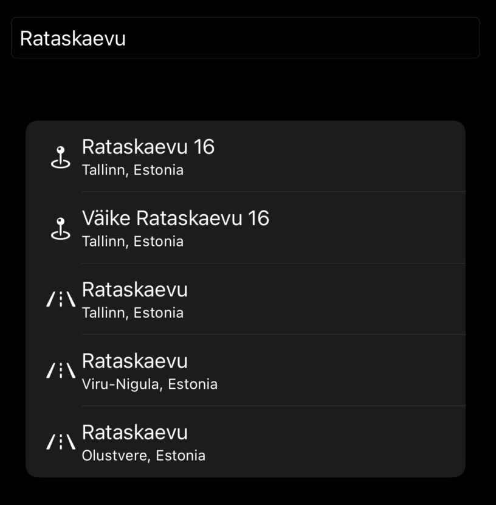

# Stadia Maps Autocomplete Search for SwiftUI

[](https://swiftpackageindex.com/stadiamaps/swiftui-autocomplete-search) [](https://swiftpackageindex.com/stadiamaps/swiftui-autocomplete-search)

This package helps you easily add geographic autocomplete search to a SwiftUI app. 

* Displays a search box and list which you can embed in other views
* Provides a callback handler with the result details when users tap a result
* Can bias search results to be nearby a specific location
* Automatically localizes place names based on the user's device settings (where available)



## Installation

The Xcode UI changes frequently, but you can usually add packages to your project using an option in the File menu.
Then, you'll need to paste in the repository URL to search: https://github.com/stadiamaps/swiftui-autocomplete-search.
See https://developer.apple.com/documentation/xcode/adding-package-dependencies-to-your-app for the latest detailed
instructions from Apple.

## Getting an API key

You will need an API key to use this view.

You can create an API key for free
[here](https://client.stadiamaps.com/signup/?utm_source=github&utm_campaign=sdk_readme&utm_content=swiftui_autocomplete_readme)
(no credit card required).

## Using the SwiftUI view

```swift
import StadiaMapsAutocompleteSearch
let stadiaMapsAPIKey = "YOUR-API-KEY"  // Replace with your API key

// Somewhere in your view body....
AutocompleteSearch(apiKey: stadiaMapsAPIKey, userLocation: userLocation.clLocation) { selection in
    // Do something with the selection.
    // For example, you might do something like this to start navigation in an app using Ferrostar.
    Task {
        do {
            routes = try await ferrostarCore.getRoutes(initialLocation: userLocation, waypoints: [Waypoint(coordinate: GeographicCoordinate(lat: selection.geometry.coordinates[1], lng: selection.geometry.coordinates[0]), kind: .break)])

            try ferrostarCore.startNavigation(route: routes!.first!)
            errorMessage = nil
        } catch {
            errorMessage = "Error: \(error)"
        }
    }
}
```

## Customizing the result views

Don't like the built-in search result view?
You can replace it with any SwiftUI view,
allowing you to customize the list item views.

```swift
AutocompleteSearch(apiKey: previewApiKey, onResultSelected: { selection in
    // TODO: Result selection handler
}) { feature, _ in
    // This custom view builder will have a classic table cell layout,
    // where the image is always a laser burst from SFSymbols.
    HStack {
        Image(systemName: "laser.burst")
        Text(feature.properties?.name ?? "<No name>")
    }
}
```
